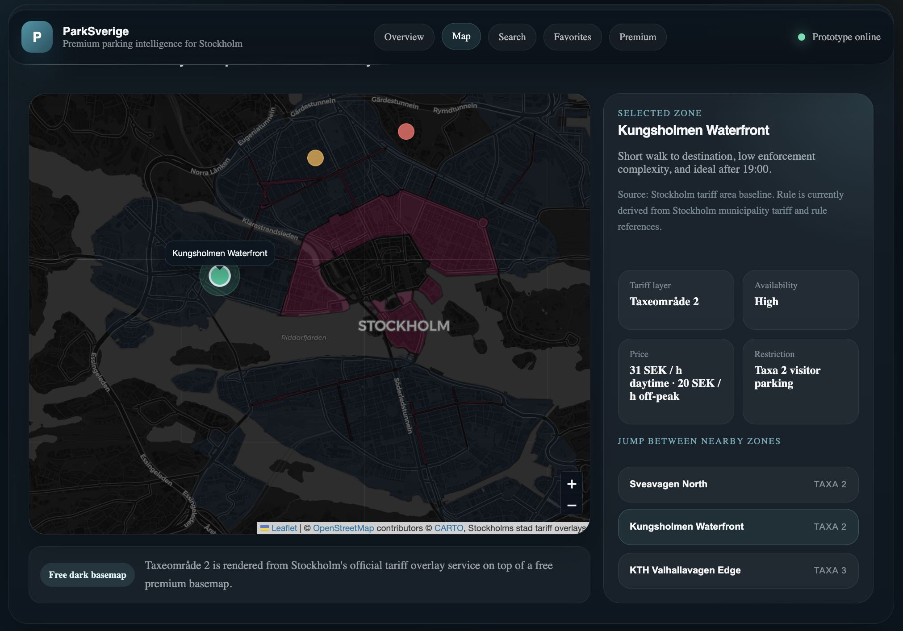

# ParkSverige

ParkSverige is a premium parking intelligence platform designed for drivers in Sweden. The product starts with Stockholm and helps users understand where they can legally park, what rules apply, when restrictions begin, and how likely an area is to have space available.


## Demo



The long-term goal is to support:

- Web
- iOS
- Android
- Future B2B and fleet experiences

## Product Direction

The product is being planned as a scalable, subscription-ready platform with:

- A high-quality map-first user experience
- Shared product logic across web and mobile
- Databricks for ingestion, ETL, analytics, and prediction
- PostgreSQL + PostGIS as the real-time serving database
- A modular backend that can grow from MVP to multi-city scale

## Planning Docs

- [Architecture and Roadmap](docs/architecture-roadmap.md)
- [Progress Tracker](docs/progress-tracker.md)
- [Postgres Serving Schema](docs/serving-schema.md)
- [Local Setup Guide](docs/local-setup.md)

## Foundation Now Added

Version 0 scaffolding is now in place with:

- `apps/web` for the Next.js customer web app
- `apps/mobile` for the Expo mobile app
- `services/api` for the NestJS backend
- `services/workers` for notifications and scheduled jobs
- `packages/*` for shared contracts, design tokens, analytics, and API client strategy
- `data-platform/databricks` for ingestion and analytics workflows
- `infra/azure` for deployment and infrastructure definitions

The first vertical slice is also started with:

- a draft PostgreSQL + PostGIS serving schema
- API stubs for `auth`, `vehicles`, `parking/search`, and `parking/zones/:id`
- richer shared contracts for sessions, zones, search, and rules
- a more product-shaped web foundation page

## Free Prototype Path

The prototype path is now designed to avoid paid map setup:

- `npm` workspaces instead of `pnpm`, to avoid Corepack issues
- OpenStreetMap-based tiles for the first visual prototype
- no Mapbox account required for the first visible version
- mobile is temporarily excluded from root installs until Expo dependency versions are aligned

Important:

- OpenStreetMap tiles are fine for local development and light prototype use
- they should not be used for offline downloads or heavy production traffic

## Recommended Target Repository Shape

As implementation begins, this repo should evolve toward a monorepo with a clear separation between apps, shared packages, backend services, and data-platform work:

```text
apps/
  web/
  mobile/
services/
  api/
  workers/
packages/
  design-system/
  api-client/
  shared-types/
  config/
data-platform/
  databricks/
infra/
  azure/
docs/
```

## Current Status

The project has now moved from planning into a real foundation phase. Legacy placeholder folders like `Backend/` and `UI/` are still present for reference, while the new monorepo structure becomes the main implementation path.
