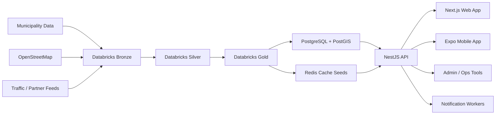

# ParkSverige Architecture and Roadmap

## 1. Product Thesis

ParkSverige should not begin as a generic parking app. It should launch as a premium parking intelligence product:

- fast to understand
- beautiful and calm to use while driving or walking
- highly reliable on rules and restrictions
- designed for recurring subscription value
- ready to scale from Stockholm to multiple Swedish cities

The winning idea is clarity and trust, not parking payments first.

## 2. Recommended Product Versions

### Version 0: Foundation

Goal: create the technical and design base before public release.

Includes:

- monorepo structure
- shared design tokens
- shared API contracts
- auth foundation
- data contracts for parking and rules
- Databricks ingestion pipelines
- PostgreSQL + PostGIS serving schema
- CI/CD, environments, observability

### Version 1: Stockholm MVP

Goal: launch the best parking rules and discovery experience in Stockholm.

Includes:

- email login and social login
- vehicle registration
- interactive map
- search by address, street, area, landmark
- parking rule lookup
- estimated availability by area
- favorites
- basic reminders
- sync across devices

### Version 1.5: Premium Subscription Release

Goal: introduce recurring paid value and stronger retention.

Includes:

- smart parking alerts
- commute-based saved zones
- offline city packs
- unlimited favorites
- home/work automation
- premium map filters
- parking planning timeline

### Version 2: Multi-City Sweden

Goal: expand across Sweden while keeping city data normalized.

Includes:

- Gothenburg, Malmo, Uppsala, Lund
- multilingual support
- municipality-specific rules engine extensions
- city-by-city operational dashboards
- improved availability prediction

### Version 3: Smart Parking Platform

Goal: evolve into a broader consumer and B2B platform.

Includes:

- live occupancy inputs
- operator integrations
- fleet dashboards
- business accounts
- EV charging overlays
- reservation and payment integrations if strategically useful

## 3. Best-Fit Technology Decisions

### Frontend

Recommended:

- Web: Next.js
- Mobile: Expo + React Native
- Shared logic: TypeScript packages in a monorepo

Why this is the best fit:

- one language across web, mobile, and backend reduces coordination cost
- Next.js gives a premium web experience, SEO, marketing flexibility, and strong performance
- Expo accelerates iOS and Android delivery
- shared packages keep product logic and contracts aligned across platforms

Important architectural choice:

- share design tokens, API types, validation, analytics events, and business logic
- do not force every UI component to be identical on web and mobile

This keeps the product synced without making the web feel like a mobile wrapper.

### Backend

Recommended:

- NestJS with TypeScript

Why:

- modular and clean for a growing product team
- strong validation and OpenAPI support
- easy onboarding
- aligns well with shared TypeScript contracts

Heavy data and prediction work should still live outside the API:

- Databricks for pipelines and ML
- background workers for scheduled jobs and event processing

### Data Platform

Recommended:

- Databricks for ingestion, cleaning, normalization, analytics, feature engineering, and prediction
- PostgreSQL + PostGIS for user-facing spatial queries
- Redis for hot reads, search caching, and notification orchestration

Critical rule:

Databricks should not directly serve app traffic. It is the analytics and processing engine, not the transactional serving layer.

## 4. Target Architecture



## 5. Recommended Monorepo Structure

```text
apps/
  web/                  Next.js customer web app
  mobile/               Expo iOS/Android app
  admin/                internal city/data ops portal later

services/
  api/                  NestJS public API
  workers/              notification jobs, sync jobs, scheduled tasks

packages/
  design-system/        colors, spacing, typography, icons, map styles
  api-client/           generated client from OpenAPI
  shared-types/         DTOs, schemas, enums, event types
  analytics/            event taxonomy and tracking helpers
  config/               eslint, tsconfig, env conventions

data-platform/
  databricks/
    notebooks/
    jobs/
    schemas/
    quality-checks/

infra/
  azure/
    environments/
    terraform/

docs/
```

## 6. Backend Domain Breakdown

Start as a modular monolith, not microservices.

Modules:

- `auth`
- `users`
- `vehicles`
- `parking-zones`
- `parking-rules`
- `search`
- `favorites`
- `subscriptions`
- `notifications`
- `availability`
- `sync`
- `admin`
- `analytics`

Why modular monolith first:

- faster to build and operate
- simpler deployments
- easier debugging
- still supports extraction later if one area becomes independently heavy

Candidate future extractions:

- notifications worker service
- prediction service
- partner integration gateway
- search indexing service

## 7. Data Architecture

### Serving Databases

Use:

- PostgreSQL for transactional data
- PostGIS for geospatial indexing and queries
- Redis for cache and short-lived state

### Databricks Responsibilities

Use Databricks for:

- ingesting municipality datasets
- cleaning and normalizing parking rules
- spatial joins between road geometry and rule data
- building availability features
- training and scoring occupancy predictions
- publishing curated serving tables to PostgreSQL

### Core Data Layers

Bronze:

- raw municipality feeds
- raw OSM extracts
- raw partner files

Silver:

- cleaned rule records
- normalized geometry
- deduplicated zone mappings
- calendar-aware restriction logic

Gold:

- parking zone serving table
- parking rule serving table
- search index export
- occupancy feature table
- analytics table

## 8. Subscription Strategy

The subscription should feel useful every week, not only when a user opens the app in a parking emergency.

### Recommended Plans

#### Free

- basic map and rule lookup
- limited favorites
- limited rule alerts
- basic search and filters

#### Plus

- smart alerts before restrictions begin
- unlimited favorites
- saved commute zones
- premium filters
- offline city pack
- parking planner timeline
- cross-device history and insights

#### Family / Multi-Car

- all Plus features
- multiple drivers
- shared saved places
- shared alerts for household vehicles

#### Fleet / Business Later

- team vehicles
- usage analytics
- compliance reminders
- driver management

### Subscription Retention Loop

To make subscriptions lively and sticky, the product should create repeated value through:

- proactive alerts
- home/work saved routines
- weekly parking outlook
- personalized zone suggestions
- reliability score and confidence indicators
- seasonal city updates such as street cleaning changes

## 9. Frontend Product Design Direction

The product should feel premium, calm, and urban.

### Design Principles

- map-first and bottom-sheet-first navigation
- low cognitive load while mobile
- strong visual trust around rules and legality
- premium but restrained styling
- fast access to the most important answer: "Can I park here?"

### Recommended UX Style

- clean Scandinavian visual direction
- soft daylight neutrals with one strong accent color
- excellent spacing and typography
- subtle elevation and glass effects only where they improve hierarchy
- large touch targets
- clear rule cards with strong status color semantics

### Design System Recommendation

Create a shared token system for:

- colors
- typography
- spacing
- radius
- iconography
- map overlay colors
- motion durations

Recommended visual palette direction:

- slate / stone neutrals
- deep blue or teal as trust accent
- green / amber / red for availability and restriction states

Recommended typography direction:

- headings: Manrope
- body: Source Sans 3 or Inter alternative with strong readability

### Primary Screens

- onboarding
- map home
- search results
- zone details sheet
- favorites
- alerts center
- subscription / upgrade
- profile and vehicles

### Web vs Mobile

Keep:

- same product language
- same rules logic
- same color system
- same event taxonomy

Allow:

- richer split views on web
- stronger map immersion on mobile
- platform-specific navigation patterns

## 10. Sync Strategy Across Web and Mobile

To keep future products aligned:

- define OpenAPI contracts first
- generate clients for web and mobile
- centralize auth/session handling rules
- centralize analytics event names
- centralize feature flags
- centralize shared enums and validation

This prevents platform drift over time.

## 11. Search and Geospatial Strategy

Search should combine:

- geocoding
- known landmarks
- city areas
- parking zones
- saved places

Recommended search stack for MVP:

- PostgreSQL + PostGIS for nearby and spatial lookup
- mock search first, then a low-cost or open geocoding layer once the UX is validated
- Redis cache for popular queries

Recommended free-first map approach for the prototype:

- web rendering with an OpenStreetMap-compatible map library
- public OSM tiles for local development and light prototype usage
- provider abstraction so we can upgrade later without rewriting the product

Future enhancement:

- dedicated search index if query volume or ranking complexity grows

## 12. Notifications Strategy

Push should be a core product feature, not an afterthought.

MVP notifications:

- parking expiration reminder
- street cleaning tomorrow reminder
- restriction starts soon reminder

Premium notifications:

- recurring commute watch
- zone risk increase
- availability trend shift
- city-specific rule change alerts

Implementation:

- FCM for Android
- APNs for iOS
- worker-based scheduling and retries

## 13. Security and Platform Standards

- JWT access tokens + refresh tokens
- bcrypt or Argon2 for passwords
- RBAC for admin tools
- audit trails for data changes
- rate limiting on public APIs
- input validation on every request
- secrets in Azure Key Vault
- PII minimization for user data
- encrypted transport everywhere

## 14. Delivery Phases

### Phase 0: Discovery and Foundation

Goal:

lock architecture, data model, repo shape, and UX direction.

Deliverables:

- architecture decision records
- design system foundation
- wireframes for key screens
- monorepo setup
- CI/CD setup
- environment strategy
- base Databricks pipeline design

Exit criteria:

- one approved architecture
- one approved design direction
- one working local developer setup

### Phase 1: Data Platform and Backend Core

Goal:

prepare reliable parking data and a stable public API.

Deliverables:

- Databricks bronze/silver/gold jobs
- PostgreSQL + PostGIS schema
- auth module
- vehicles module
- parking and rules modules
- search module
- Swagger docs

Exit criteria:

- API can return parking zones and rules for Stockholm
- data refresh pipeline is repeatable

### Phase 2: Web MVP

Goal:

launch a premium-quality Stockholm web app first.

Deliverables:

- onboarding and auth
- map experience
- search
- zone details
- favorites
- profile and vehicles
- basic notifications entry points

Why web first:

- fastest iteration on UX
- easiest to validate premium positioning
- easier early QA and demos

Exit criteria:

- a Stockholm user can search, inspect rules, save places, and manage vehicles

### Phase 3: Mobile MVP

Goal:

extend the same core product to iOS and Android with offline support.

Deliverables:

- Expo mobile app
- push notification setup
- offline cache of recent zones and favorites
- deep links from alerts to zone screens

Exit criteria:

- a mobile user can complete the same primary jobs as on web

### Phase 4: Subscription and Retention

Goal:

turn the product into a recurring subscription business.

Deliverables:

- billing integration
- free vs premium entitlements
- smart alerts
- unlimited favorites
- commute routines
- subscription analytics dashboard

Exit criteria:

- subscription conversion funnel is live
- entitlements work across web and mobile

### Phase 5: Multi-City and Intelligence

Goal:

expand coverage and improve predictive quality.

Deliverables:

- multi-city data onboarding framework
- multilingual support
- improved ML scoring
- admin tools for data QA

Exit criteria:

- onboarding a new city becomes an operational process, not a custom rebuild

## 15. Recommended Execution Order

If the team is small, follow this order:

1. architecture and data contracts
2. Databricks pipeline and serving schema
3. NestJS API
4. web MVP
5. mobile MVP
6. subscription layer
7. multi-city expansion

This sequence is safer than building mobile and advanced subscriptions before the parking data quality is proven.

## 16. Success Metrics

### Product

- search-to-zone-view rate
- favorite save rate
- alert opt-in rate
- weekly active users
- subscription conversion
- subscription retention

### Data Quality

- rule accuracy rate
- stale data rate
- successful daily refresh rate
- municipality ingestion coverage

### Engineering

- API p95 latency
- crash-free sessions
- cache hit rate
- release frequency
- mean time to recovery

## 17. Strong Recommendations

- Do not start with microservices.
- Do not use Databricks as the app database.
- Do not build payments before users trust the rule engine.
- Ship web before trying to perfect all three platforms at once.
- Treat notifications and subscriptions as a product loop, not just a pricing page.
- Invest early in the map UX and rule clarity because that is the core differentiation.

## 18. Recommended Immediate Next Step

The next implementation step should be:

build Version 0 as a monorepo foundation with:

- `apps/web`
- `apps/mobile`
- `services/api`
- `packages/design-system`
- `packages/shared-types`
- `data-platform/databricks`

That gives the project a clean base for the MVP and keeps future versions synced.
